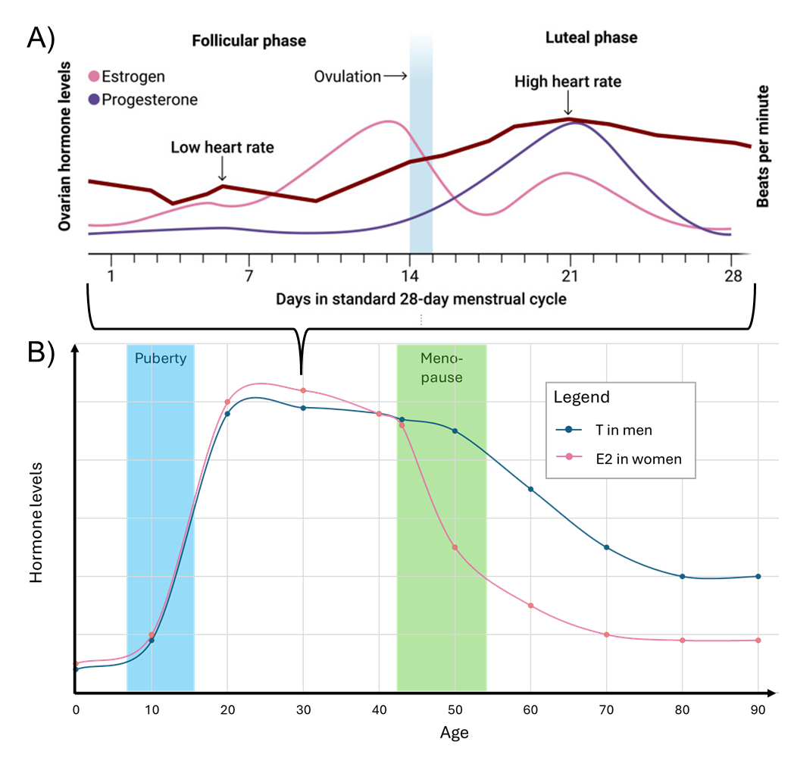
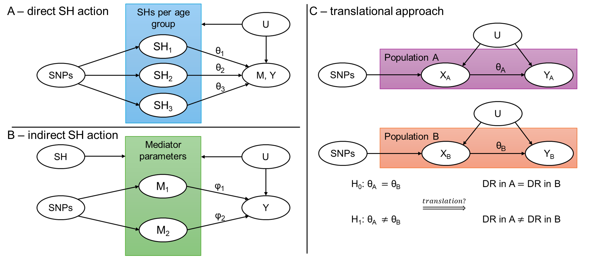

# About

Biological sex is an independent risk factor for many diseases, their progression, and their respective biomarkers. Examples include **coronary artery disease**, **chronic kidney disease**, and **Alzheimer's disease**. Also **immune response** and inflammatory pathways differ between men and women. 

Within this project, I plan to analyse (hormonal) sex differences in multiple OMICS levels as well as complex diseases. Hormone levels highly depend on phase of life, with changes during **puberty** in both sexes, and **menopause** and the **menstrual cycle** in women. Hence, I will also include data from longitudinal studies and expand cross-sectional studies with data from electronic health records.  

|  | 
|:--:| 
|Hormone levels over lifetime. A) Variability in estradiol (E2) and progesterone levels and resting heart rate in females across the menstrual cycle. On average, the heart rate increases when progesterone levels are high. Figure taken from Prinsen J, Villringer A, Sacher J. The monthly rhythm of the brain-heart connection. Sci Adv. 2025;11: eadt1243. doi:10.1126/sciadv.adt1243. B) Estradiol (E2) in women and testosterone (T) in men increase both during puberty and stay on a high level in early adulthood. With the onset of menopause, the estradiol levels decrease sharply, while in men the testosterone levels decrease linear with age.|

We aim at extracting genetic instruments per life phase and then apply them in multiple Mendelian Randomization approaches to test for independent effects of hormones per phase on various outcomes

|  | 
|:--:| 
| Directed acyclic graphs of Mendelian Randomization (MR) approaches. A) Direct SH action. In a multivariable MR (MVMR) approach, the effect of SH on an outcome Y conditional on age groups can be tested. These age groups will be childhood, early, and late adulthood, or the mean and trend of SH levels during puberty or menopause. B) Indirect SH action. Using longitudinal data for a mediator M, e.g. lipids or heart rate, the MVMR approach can be adapted to test for independent effects of different parameters of the distribution of M, e.g. mean and variability, on Y. C) Translation. MR estimates θA and θB derived from independent populations A and B, e.g. men and women, can be used to identify significant differences in effect sizes. We will attempt to translate these differences to drug responses (DR) in the different populations.|

# Contact 

Do not hesitate to contact me in case you are interested in these kind of analyses, or if you have data to share!

- Janne Pott (janne.pott@mrc-bsu.cam.ac.uk)

- [back to main page](./../)
- [back to data overview](./)
